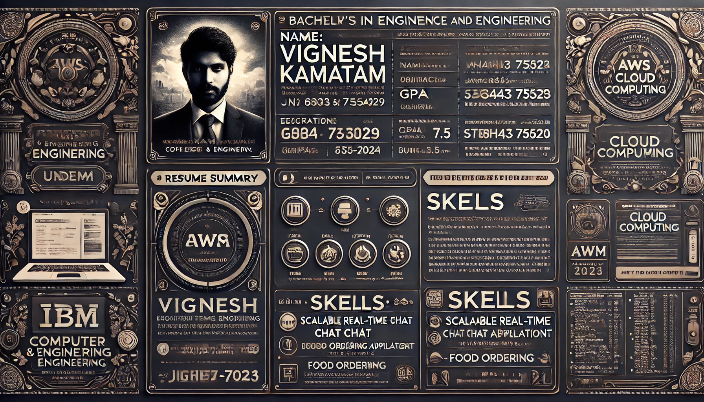

# 💫 About Me  
### Hi, I'm Vignesh Kamatam! 👋      
🚀 **Passionate Full-Stack Developer** skilled in **Next.js, Node.js, Prisma, and AWS**, building **scalable, real-time applications**.     
💻 Exploring **cloud computing, DevOps, and system design** to optimize **high-performance distributed systems**.     
⚡ Love solving **DSA challenges**—solved **190+ problems on LeetCode** and enjoy **reverse engineering**.     
📚 Currently learning **Three.js, Docker, and Kubernetes** for **scalable and interactive web applications**.     
🤝 Open to **collaborations** on **open-source projects, cloud computing, and innovative web solutions**.     

## 🌐 Socials:
  

# 💻 Tech Stack:
                         
# 📊 GitHub Stats:

  
  
  

## 🏆 GitHub Trophies

### ✍️ Random Dev Quote

### 🔝 Top Contributed Repo

---

<!-- Proudly created with GPRM ( https://gprm.itsvg.in ) -->

<picture>
  <source media="(prefers-color-scheme: dark)" srcset="https://raw.githubusercontent.com/vigneshk-github/vigneshk-github/output/github-snake-dark.svg" />
  <source media="(prefers-color-scheme: light)" srcset="https://raw.githubusercontent.com/vigneshk-github/vigneshk-github/output/github-snake.svg" />
  
</picture>

<!-- Proudly created with GPRM ( https://gprm.itsvg.in ) -->
